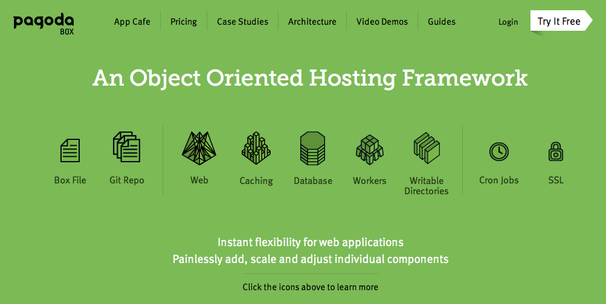
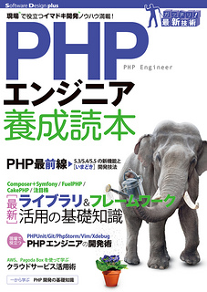

# FuelPHP のデータベースマイグレーションを Pagoda Box で使うときの注意

[FuelPHP Advent Calendar 2013](http://atnd.org/events/45096) の 3 日目です。昨日は、[@kenji\_s](https://twitter.com/kenji_s) さんの「[FuelPHPの開発環境を20分で構築する（Vagrant編）](http://blog.a-way-out.net/blog/2013/12/02/quick-mastering-fuelphp/)」でした。

今日は、FuelPHP の データベースマイグレーションを [Pagoda Box](http::/pagodabox.com) で使う時にハマるポイントについて書きたいと思います。テーマがニッチ過ぎて、同じようなことで困っている人が他にもいるのか少し心配ではありますが、気にせず行きたいと思います。

## Pagoda Box とは

まず、Pagoda Box ってなんや？というはなしを。

[Pagoda Box](http::/pagodabox.com) は、LAMP 環境を構築できる PHP 専門の PaaS です。

PHP が使える PaaS はいくつかありますが、Pagoda Box は PHP に特化した PaaS なので、PHP エンジニアにはとてもなじみやすく、僕は結構気に入ってよく使っています。ちなみに、FuelPHP の公式サイトも Pagoda Box 上で動いているようです。

なお、Pagoda Box については、この間発売されたこの本に書きました。みなさん、よければ読んでみてください。

[PHPエンジニア養成読本 〔現場で役立つイマドキ開発ノウハウ満載! 〕 (Software Design plus)](http://www.amazon.co.jp/gp/product/4774159719/)

技術評論社

（著）新原 雅司、原田 康生、小山 哲志、田中 久輝、保科 一成、大村 創太郎、増永 玲

（編集）PHPエンジニア養読本編集部

## FuelPHP データベースマイグレーションのおさらい

続いて、FuelPHP でのデータベースマイグレーションの手順を簡単におさらいしておきましょう。

公式サイトの説明は、[http://fuelphp.com/docs/general/migrations.html](http://fuelphp.com/docs/general/migrations.html) ですね。

### oil generate model

`$ oil generate model xxx` で model クラスと、マイグレーション用のクラスが一気に作られます。僕は好みで、`--crud` を使うことが多いです（というかcrud しか使いません）。

    % php oil generate model post id:int name:varchar message:text created_at:datetime --crud --mysql-timestamp
        Creating model: /Users/omoon/Documents/www/speak_on_fuelphp/fuel/app/classes/model/post.php
        Creating migration: /Users/omoon/Documents/www/speak_on_fuelphp/fuel/app/migrations/001_create_posts.php

で、つくられるmodelクラス。

    // fuel/app/classes/model/post.php
    class Model_Post extends \Model_Crud
    {
        protected static $_properties = array(
            'id',
            'name',
            'message',
            'created_at'
        );
        protected static $_mysql_timestamp = true;
        protected static $_table_name = 'posts';
    }

つくられるマイグレーションクラス

    // fuel/app/migrations/001_create_posts.php
    namespace Fuel\Migrations;
    class Create_posts
    {
        public function up()
        {
            \DBUtil::create_table('posts', array(
                'id' => array('constraint' => 11, 'type' => 'int'),
                'name' => array('constraint' => 255, 'type' => 'varchar'),
                'message' => array('type' => 'text'),
                'created_at' => array('type' => 'datetime'),

            ), array('id'));
        }
        public function down()
        {
            \DBUtil::drop_table('posts');
        }
    }

### oil r migrate

で、`$ oil r migrate`で該当テーブルがデータベースに作成されます。この際、

-   データベース上に `migration` というテーブル
-   `fuel/app/config/FUEL_ENV/migrations.php` というファイル（`FUEL_ENV` は環境）

が作成され、マイグレーションの状況を管理するしくみになっています。

## なにが問題なのか

このしくみを使って、Pagoda Box へアプリケーションをデプロイしたタイミングでデータベースの初期化まで一気にやってしまいたいのですが、以下の問題がありうまくいかないということがわかりました。

-   `$ oil r migration` 実行時に `fuel/config/production/migrations.php` ファイルが生成されるので、`fuel/config/production/` を writable にする必要がある
-   Pagoda Box では、writable ディレクトリは、ソースコードレポジトリとは別に、ネットワーク上にマウントされる
-   そのため、同じディレクトリにあるデータベースへの接続ファイル `fuel/config/production/db.php` が消える
-   データベースへの接続ができなくなる

## 解決方法

-   `fuel/app/config/pagoda/db.php`に別ファイルで Pagoda Box 甩設定ファイルを用意しておく
-   before\_deploy フックで、`fuel/app/config/pagoda/db.php` ファイルを`fuel/app/config/production/` 配下へコピーする

という作戦で解決です。

参考までに Boxfile 例。

    global:
      env:
        - FUEL_ENV: production
    db1:
      type: mysql
      name: speak
    web1:
      shared_writable_dirs:
        - /fuel/app/cache
        - /fuel/app/logs
        - /fuel/app/tmp
        - /fuel/app/config/production # <- migrations.php が作られるためwritableに
     document_root: public
     php_version: 5.4.14
     php_date_timezone: "asia>
    fuel/app/config/pagoda.db.php はこうなります。

    return array(
        'default' => array(
            'connection'  => array(
                'dsn'        => 'mysql:host='.$_SERVER['DB1_HOST'].';port='.$_SERVER['DB1_PORT'].';dbname='.$_SERVER['DB1_NAME'],
                'username'   => $_SERVER['DB1_USER'],
                'password'   => $_SERVER['DB1_PASS'],
            ),
        ),
    );

これで、`$ git push pagoda` で一気にアプリケーションのデプロイからデータベースの初期化までできるようになります。

それでは、また。

明日は、[mikakane](https://twitter.com/mkkn_info) さんです。
